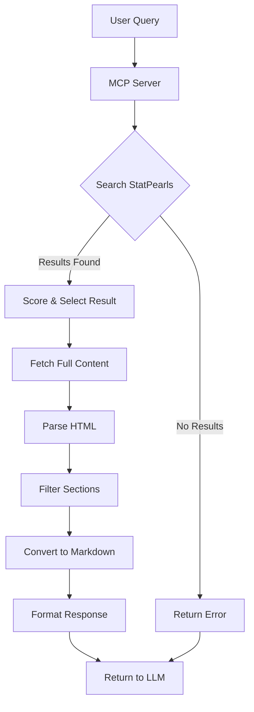

# StatPearls MCP Server Implementation Plan

## Overview

This document outlines the detailed implementation plan for converting the existing Brave Search MCP server to a StatPearls MCP server that fetches disease information from NCBI's StatPearls collection.

## Implementation Steps

### 1. Server Configuration

- [ ] Update server name and version to reflect StatPearls focus
- [ ] Remove Brave API key requirement
- [ ] Define StatPearls tool schema with appropriate parameters
  - Required: `query` (disease name to search for)
  - Optional: `format_options` (to control output formatting)

### 2. Search Functionality

- [ ] Implement function to construct NCBI search URL: `https://www.ncbi.nlm.nih.gov/books/NBK430685/?term=<query>`
- [ ] Create function to fetch search results page
- [ ] Implement HTML parsing to extract search results
  - Extract title, URL, and brief description for each result
  - Handle pagination if necessary

### 3. Result Selection

- [ ] Implement relevance scoring algorithm for search results
  - Consider exact matches in title
  - Consider keyword frequency
  - Consider result position in search results
- [ ] Select the most relevant result based on scoring

### 4. Content Retrieval

- [ ] Implement function to fetch the full content of the selected article
- [ ] Create HTML parser to extract the article content
  - Identify and extract article sections
  - Handle special elements like tables, images, and lists

### 5. Content Processing

- [ ] Implement section filtering to exclude standard sections:
  - References
  - Author Information
  - Copyright Information
  - Other non-essential sections
- [ ] Use turndown to convert HTML content to markdown
  - Configure turndown for optimal medical content formatting
  - Handle special elements appropriately

### 6. Response Formatting

- [ ] Format the processed content as a structured response
- [ ] Include metadata (title, source URL, etc.)
- [ ] Return formatted content to the LLM

### 7. Error Handling

- [ ] Implement robust error handling for:
  - Network failures
  - No search results found
  - Content parsing errors
  - Invalid queries
- [ ] Provide informative error messages

### 8. Testing

- [ ] Create test cases for various disease queries
- [ ] Test edge cases (rare diseases, ambiguous terms)
- [ ] Verify markdown formatting quality
- [ ] Test error handling

### 9. Build Process

- [ ] Create a build script using Bun's bundler
- [ ] Configure the build to output a vanilla Node.js compatible file in the dist folder
- [ ] Include all dependencies in the bundle
- [ ] Set appropriate file permissions for execution
- [ ] Verify portability across environments with Node.js (without requiring Bun)

## Implementation Timeline

1. Server Configuration & Search Functionality (Days 1-2)
2. Result Selection & Content Retrieval (Days 3-4)
3. Content Processing & Response Formatting (Days 5-6)
4. Error Handling & Testing (Days 7-8)
5. Build Process & Final Testing (Days 9-10)

## Technical Approach

### HTML Parsing Strategy

We'll use a combination of DOM parsing and regular expressions to extract content from the StatPearls pages:

1. Use a DOM parser to navigate the page structure
2. Identify article sections by their headings
3. Extract content within each section
4. Apply special handling for tables, lists, and other structured content

### Markdown Conversion

The turndown library will be configured with custom rules to handle:

1. Medical terminology preservation
2. Table formatting
3. List preservation
4. Image references (if any)

## Mermaid Diagram: System Flow



## Mermaid Diagram: Component Architecture

```mermaid
classDiagram
    class MCPServer {
        +name: string
        +version: string
        +connect()
        +setRequestHandler()
    }
    
    class StatPearlsTool {
        +name: string
        +description: string
        +inputSchema: object
    }
    
    class SearchHandler {
        +performSearch(query)
        +selectResult(results)
    }
    
    class ContentProcessor {
        +fetchContent(url)
        +parseHTML(content)
        +filterSections(sections)
        +convertToMarkdown(html)
    }
    
    class ResponseFormatter {
        +formatResponse(content, metadata)
    }
    
    MCPServer --> StatPearlsTool : defines
    MCPServer --> SearchHandler : uses
    SearchHandler --> ContentProcessor : uses
    ContentProcessor --> ResponseFormatter : uses